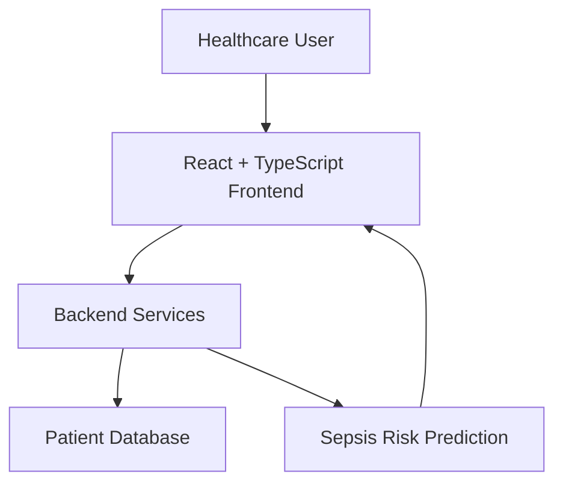
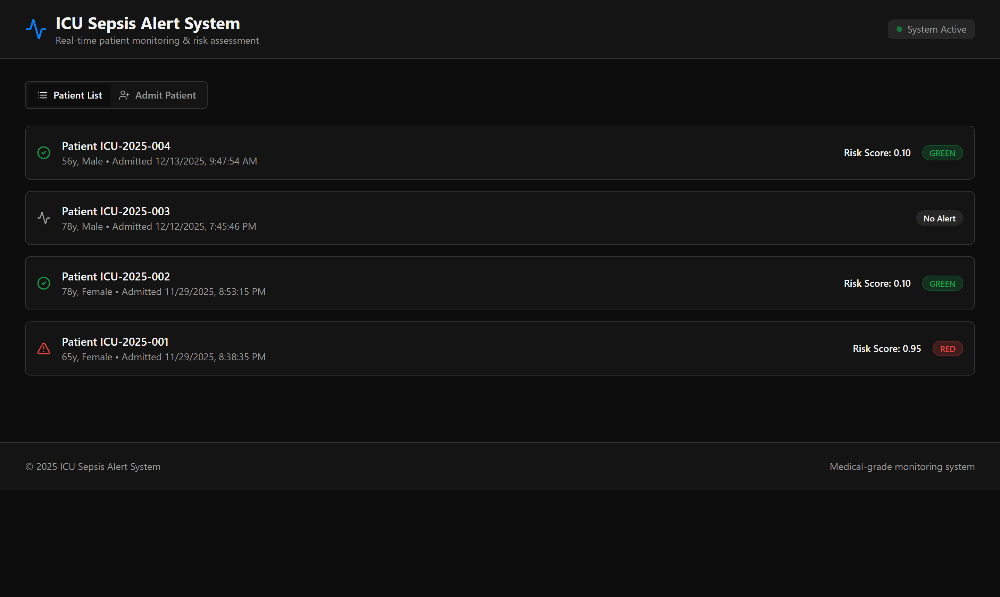
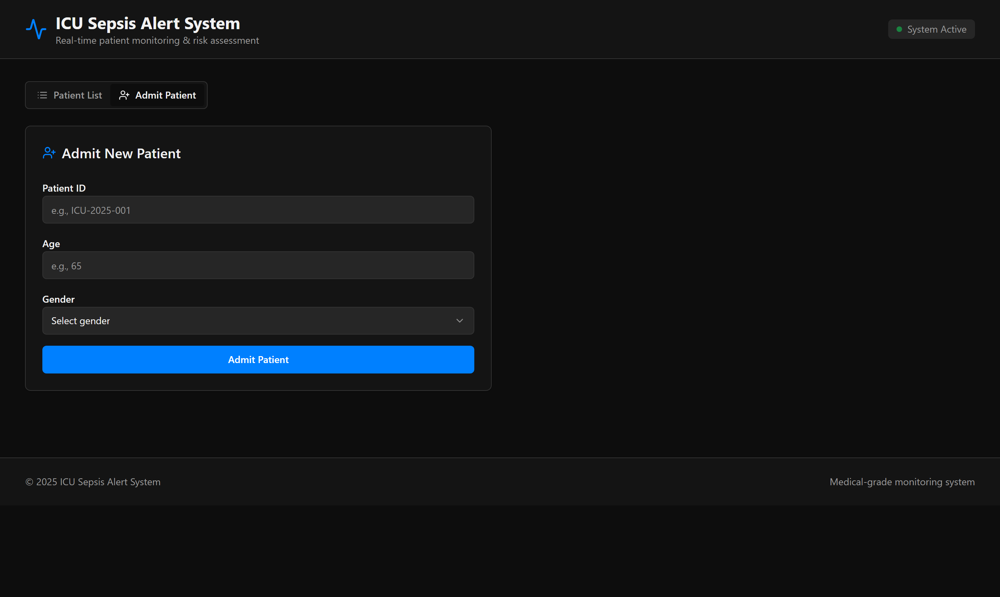
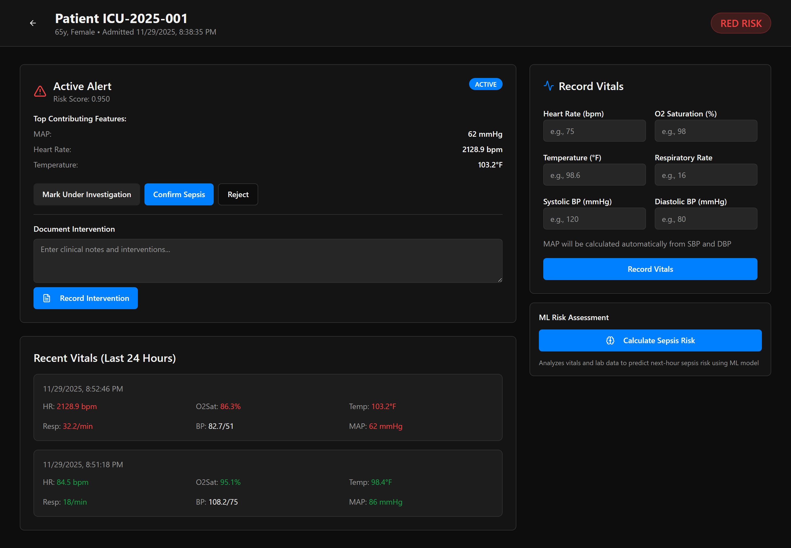
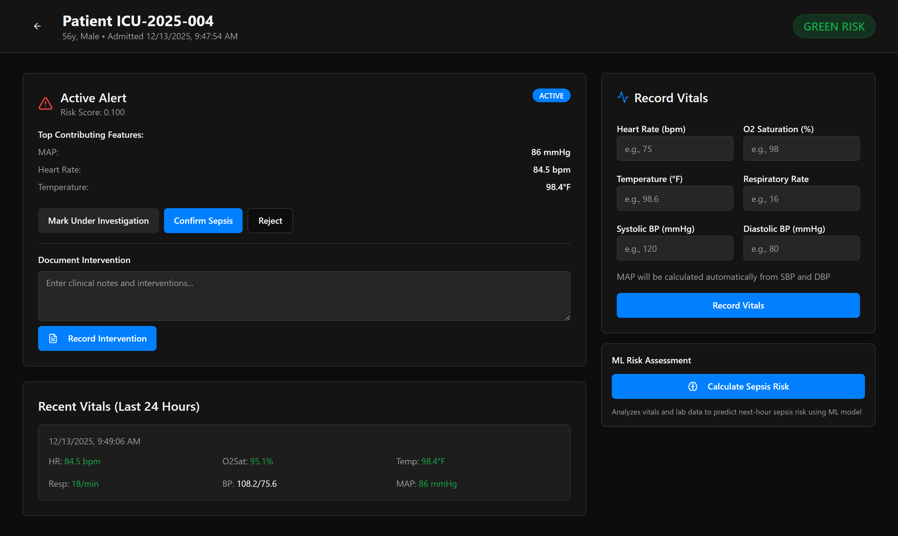

# Sepsis Vigil – ICU Sepsis Alert System

Sepsis Vigil is a healthcare web application designed to assist in the early identification and monitoring of sepsis risk among ICU patients. The application provides an intuitive interface for admitting patients, viewing patient records, monitoring vital signs, and displaying sepsis risk predictions to support timely clinical decision-making.

This project was developed as an academic team project using **React, TypeScript, Vite, Tailwind CSS, and modern frontend technologies**.

# Live Demo

https://shreya-raj08.github.io/sepsis-vigil/

# Project Features

- Admit new ICU patients through an interactive form.
- Maintain a centralized patient list.
- View individual patient details.
- Monitor patient vital signs.
- Display sepsis risk prediction results.
- Clean and responsive user interface.
- Modern component-based architecture.
- Fast frontend powered by Vite.

# Project Structure

```text
sepsis-vigil
│
├── public/
│
├── src/
│   ├── components/
│   ├── pages/
│   ├── hooks/
│   ├── integrations/
│   ├── lib/
│   ├── App.tsx
│   └── main.tsx
│
├── package.json
├── package-lock.json
├── vite.config.ts
└── README.md
```

# Technologies Used

## Frontend

- React
- TypeScript
- Vite
- Tailwind CSS

## UI Components

- shadcn/ui
- Radix UI
- Lucide React

## State Management

- TanStack React Query

## Backend / Integration

- Supabase Client

## Development Tools

- ESLint

## System Architecture



# System Workflow

1. User opens the Sepsis Vigil application.
2. New ICU patients can be admitted through the admission form.
3. Patient information is stored and displayed in the patient list.
4. Users can open an individual patient's profile.
5. Patient vital signs are monitored.
6. The application displays the patient's sepsis risk prediction.
7. Healthcare professionals can use the displayed information to assist clinical decision-making.

# Application Modules

## Patient Management

- Admit new patients
- View patient list
- Access patient details

## Vital Signs Monitoring

- Record patient vitals
- Display patient health information

## Sepsis Prediction

- Display predicted sepsis risk
- Present prediction results through the user interface

# Local Setup

## Clone the Repository

```bash
git clone https://github.com/Shreya-Raj08/sepsis-vigil.git
```

## Navigate to the Project Directory

```bash
cd sepsis-vigil
```

## Install Dependencies

```bash
npm install
```

## Start Development Server

```bash
npm run dev
```

The application will be available at:

```
http://localhost:8080
```

# Screenshots

## Patient List

The main dashboard lists all admitted ICU patients with their latest sepsis risk score and a colour-coded alert badge, so the highest-risk patients stand out at a glance.



## Admit Patient

New patients are admitted through a simple form capturing patient ID, age, and gender.



## Patient Detail, Vitals & Risk Assessment

The patient view combines the active sepsis alert and its top contributing features with a vitals entry panel, a 24-hour vitals history, and the ML risk assessment action. Out-of-range values are highlighted in red, and clinicians can confirm, reject, or flag the alert for investigation.



## Low Risk Patient

For a patient whose vitals are within normal range, the same view reports a GREEN risk classification and a low risk score, with in-range vitals shown in green.



# Build for Production

```bash
npm run build
```

Preview the production build

```bash
npm run preview
```

# Project Highlights

- Modern React application
- TypeScript implementation
- Component-based architecture
- Responsive healthcare dashboard
- Modular UI using shadcn/ui
- Fast development with Vite
- Clean and scalable code structure


# Future Enhancements

- Real-time patient monitoring
- Integration with hospital databases
- Machine Learning model deployment
- Doctor authentication
- Electronic Health Record (EHR) integration
- Alert notifications
- Patient history visualization
- Analytics dashboard
