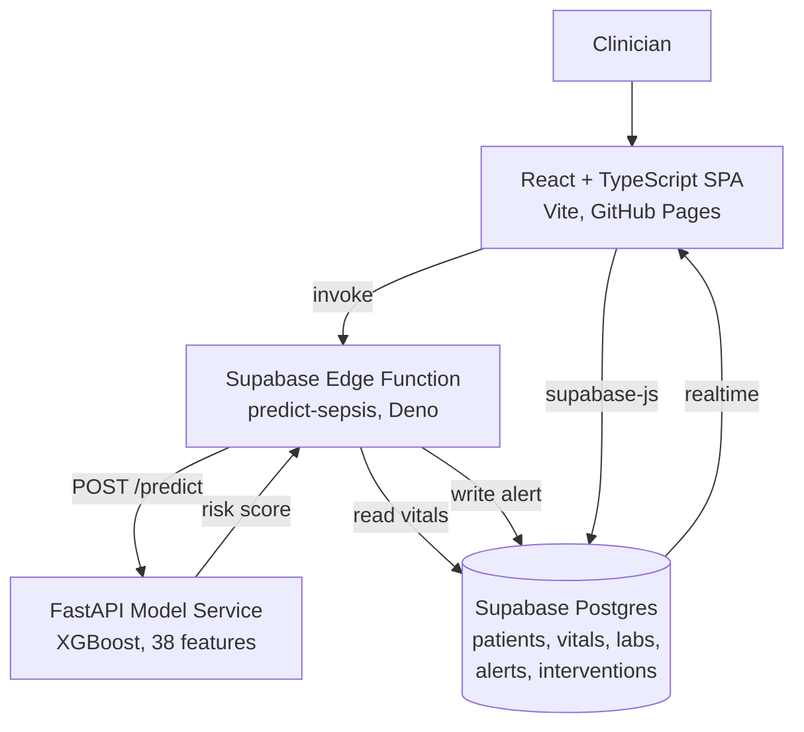

# Sepsis Vigil – ICU Sepsis Alert System

Sepsis Vigil is a full-stack ICU monitoring web application that flags patients at risk of sepsis. Clinicians admit patients, record hourly vital signs and run a risk assessment. A trained XGBoost model returns a risk probability, which is mapped to a colour-coded alert tier (green, yellow or red) and shown on the dashboard in real time.

The project was developed as an academic project using **React, TypeScript, Vite, Tailwind CSS, Supabase, Python, FastAPI and XGBoost**.


# Live Demo

https://shreya-raj08.github.io/sepsis-vigil/

# Project Features

- Admit ICU patients with patient ID, age and gender.
- View all admitted patients in a single dashboard with their latest risk score.
- Record hourly vital signs (HR, O2Sat, Temperature, Respiratory rate, SBP, DBP).
- Automatic MAP calculation from systolic and diastolic blood pressure. 
- Run sepsis risk prediction using a trained XGBoost model.
- Colour-coded alert tiers based on the predicted probability.
- Live dashboard updates through Supabase Realtime, without a page refresh. 
- Highlighting of vital signs that fall outside normal reference ranges.
- Clinician alert workflow: investigate, confirm or reject an alert.
- Document interventions with free-text notes against an alert.
- Lab results schema for future feature expansion.
- Dark, medical-grade responsive interface for desktop and tablet.

# System Architecture



The frontend never calls the model service directly. The edge function is the only component that holds the model API URL. It reads the patient record and recent vitals from Postgres, builds the feature payload, calls the FastAPI service and writes the resulting alert back to the database.

# Technologies Used

## Frontend

- React 18
- TypeScript
- Vite
- Tailwind CSS
- React Router
- TanStack React Query
- React Hook Form and Zod
- Recharts

## UI Components

- shadcn/ui
- Radix UI
- Lucide React

## Backend

- Supabase (PostgreSQL)
- Supabase Edge Functions (Deno)
- Supabase Realtime
- Row-Level Security

## Machine Learning

- Python
- XGBoost
- scikit-learn
- pandas and NumPy
- Matplotlib
- Jupyter Notebook

## Model API

- FastAPI
- Uvicorn
- Pydantic

## Deployment

- GitHub Pages (React frontend)
- Supabase (database and edge function)
- Any Python host such as Render, Railway or Fly.io (model API)

## Development Tools

- ESLint
- TypeScript ESLint

# System Workflow

1. The clinician opens the Sepsis Vigil dashboard.
2. A new ICU patient is admitted through the admission form.
3. Patient details are stored in the Supabase patients table.
4. Hourly vital signs are recorded for the patient. MAP is calculated automatically.
5. The clinician opens the patient profile and clicks Calculate Sepsis Risk.
6. The frontend invokes the predict-sepsis edge function with the patient ID.
7. The edge function loads the patient record and the six most recent vitals rows.
8. Incomplete vitals rows are discarded and the remaining rows are ordered oldest to newest.
9. The ICU hour is calculated from the admission time and the newest vitals timestamp.
10. The payload is sent to the FastAPI model service.
11. The service rebuilds all 38 features and scores the newest row with XGBoost.
12. The risk score and alert tier are returned to the edge function.
13. The edge function creates a new alert or updates the patient's existing active alert.
14. The dashboard picks up the change over Realtime and shows the updated tier.
15. The clinician confirms, rejects or investigates the alert and documents any intervention.

# Machine Learning Model

The model is trained in `EarlySepsisDetection-12col-no-PatientID.ipynb` and exported to XGBoost's JSON format, so the FastAPI service can load it without a pickle dependency.

## Model Features

The model uses 38 features in total.

Raw vitals (7):

- HR, SBP, MAP, DBP, Resp, O2Sat, Temp

Patient context (3):

- Hour (hours since admission)
- Age
- Gender (Male = 1, Female = 0)

Temporal features, computed for each of the seven vitals:

- `<vital>_mean6h`, the 6-hour rolling mean
- `<vital>_std6h`, the 6-hour rolling standard deviation
- `<vital>_delta`, the hour-over-hour change
- `<vital>_trend3h`, the 3-hour rolling mean of the deltas

The exact feature list and order are stored in `model-api/model_config.json` and repeated in `model-api/app.py`. XGBoost is sensitive to feature order, so any change to the training features must be applied in both places.

## Training Setup

- Patients are split with `GroupShuffleSplit` (80/20, `random_state=42`) grouped on `Patient_ID`, so all rows belonging to one patient stay on the same side of the split.
- `Patient_ID` is not used as a predictive feature. It is only the grouping key. 
- Temporal features are computed after the split, separately within each split and grouped by patient, so no information crosses the train/test boundary.
- The classifier is deliberately regularised to limit overfitting:

```python
xgb.XGBClassifier(
    max_depth=3,
    min_child_weight=10,
    subsample=0.5,
    colsample_bytree=0.5,
    learning_rate=0.05,
    n_estimators=200,
    reg_alpha=10,
    reg_lambda=20,
    random_state=42,
    eval_metric="logloss"
)
```

- Evaluation reports accuracy, precision, recall, F1, ROC-AUC and AUPRC, together with a confusion matrix, ROC curve and precision-recall curve.

## Alert Thresholds

The predicted probability is mapped to a tier:

- Below 0.30: green
- 0.30 to 0.70: yellow
- 0.70 and above: red

## Retraining the Model

```bash
pip install pandas numpy xgboost scikit-learn matplotlib jupyter
jupyter notebook EarlySepsisDetection-12col-no-PatientID.ipynb
```

The final cell regenerates `xgb_sepsis_no_patient_id.json` and `model_config.json`. Copy both into the `model-api` folder to deploy the new model.

# Database

Supabase PostgreSQL is used to store all application data. The full schema, including enums, indexes, triggers and Row-Level Security policies, is in `supabase/migrations`.

## Patients Table

- Patient ID (unique)
- Age
- Gender
- Admission time

## Vitals Table

- Heart rate, O2 saturation, temperature, respiratory rate
- Systolic and diastolic blood pressure
- MAP (calculated on insert)
- Recorded at

## Labs Table

- FiO2, pH, PaCO2
- Creatinine, BUN, Lactate
- Platelets, WBC, Hgb
- Potassium, Calcium, Glucose

## Alerts Table

- Risk score
- Alert tier (green, yellow, red)
- Status (active, under investigation, confirmed, rejected)
- Top contributing values, stored as JSON

## Interventions Table

- Linked alert and patient
- Action taken
- Clinician notes
- Created by

The alerts table is added to the `supabase_realtime` publication, which is what drives the live dashboard updates.

# Model API Endpoints

The FastAPI service in `model-api/app.py` exposes two endpoints.

## GET /health

Returns the service status. Used for uptime checks after deployment.

```json
{ "status": "ok" }
```

## POST /predict

Scores a patient and returns a sepsis risk probability.

### Request Body

- `age`, the patient's age
- `gender`, either Male or Female
- `hour`, hours since admission
- `vitals`, a list of recent vitals records, each with `recorded_at`, `hr`, `sbp`, `map`, `dbp`, `resp`, `o2sat` and `temp`

### Functionality

- Sorts the vitals records from oldest to newest.
- Rebuilds the rolling mean, rolling standard deviation, delta and 3-hour trend features.
- Selects the newest row and appends Hour, Age and encoded Gender.
- Runs `predict_proba` on the trained model.
- Maps the probability to an alert tier.

### Response

```json
{
  "risk_score": 0.1043,
  "alert_tier": "green",
  "model": "XGBoost (Patient_ID excluded)",
  "features_used": 38
}
```

# Local Setup

## Clone the Repository

```bash
git clone https://github.com/Shreya-Raj08/sepsis-vigil.git
cd sepsis-vigil
```

## Frontend Setup

Install all dependencies.

```bash
npm install
```

Create a `.env.local` file in the project root.

```env
VITE_SUPABASE_URL=https://your-project-ref.supabase.co
VITE_SUPABASE_PUBLISHABLE_KEY=your_anon_publishable_key
```

Start the development server.

```bash
npm run dev
```

The application runs at:

```
http://localhost:8080
```

## Model API Setup

Move into the model API folder and create a virtual environment.

```bash
cd model-api
python -m venv .venv
source .venv/bin/activate
```

On Windows, activate it with:

```bash
.venv\Scripts\activate
```

Install the Python dependencies and start the server.

```bash
pip install -r requirements.txt
uvicorn app:app --reload --port 8000
```

Check that the service is running.

```bash
curl http://localhost:8000/health
```

Interactive API documentation is available at `http://localhost:8000/docs`. The model path can be overridden with the `MODEL_PATH` environment variable. It defaults to `xgb_sepsis_no_patient_id.json` in the working directory.

## Supabase Setup

Apply the database migration and deploy the edge function.

```bash
supabase link --project-ref your-project-ref
supabase db push
supabase secrets set ML_API_URL=https://your-model-api-host
supabase functions deploy predict-sepsis
```

Note: the edge function runs on Supabase infrastructure and cannot reach `localhost`. To test against a locally running model API, expose it with a tunnel such as `ngrok http 8000` and set `ML_API_URL` to the tunnel URL.

## Environment Variables

- `VITE_SUPABASE_URL`, the Supabase project URL, read at frontend build time.
- `VITE_SUPABASE_PUBLISHABLE_KEY`, the Supabase anon key, read at frontend build time.
- `ML_API_URL`, the base URL of the model API, stored as an edge function secret.
- `MODEL_PATH`, optional path to the XGBoost model file used by the model API.

# Screenshots

## Patient List

The dashboard lists all admitted ICU patients with their latest sepsis risk score and a colour-coded alert badge, so the highest-risk patients stand out at a glance.


## Admit Patient

New patients are admitted through a form capturing patient ID, age and gender.


## Patient Detail, Vitals and Risk Assessment

The patient view combines the active alert and its contributing values with a vitals entry panel, a 24-hour vitals history and the risk assessment action. Out-of-range values are highlighted in red, and clinicians can confirm, reject or flag the alert for investigation.


## Low Risk Patient

For a patient whose vitals are within normal range, the same view reports a GREEN classification with a low risk score and in-range vitals shown in green.


# Deployment

## Frontend

Pushes to `main` trigger the workflow in `.github/workflows/deploy.yml`, which builds the app and publishes the `dist` folder to GitHub Pages.

Two details make the single-page app work under a project subpath:

- `vite.config.ts` sets `base` to `/sepsis-vigil/` in production, and React Router reads `import.meta.env.BASE_URL` as its `basename`.
- The workflow copies `dist/index.html` to `dist/404.html`, so deep links such as `/patient/:id` are handed to the client-side router instead of returning a 404 on reload.

Vite inlines `VITE_*` variables at build time, so `VITE_SUPABASE_URL` and `VITE_SUPABASE_PUBLISHABLE_KEY` have to be available to the `npm run build` step. Add them as repository secrets or variables and pass them through as `env` on that step, otherwise the deployed build ships without a Supabase connection.

Build commands:

```bash
npm run build
npm run preview
npm run lint
```

## Model API

The FastAPI service is a standard ASGI application and can be hosted on any platform that runs Python, such as Render, Railway, Fly.io or a virtual machine. Deploy it first, then point the edge function's `ML_API_URL` secret at the public URL.

```bash
uvicorn app:app --host 0.0.0.0 --port ${PORT:-8000}
```

# Known Limitations

- The model was trained on a synthetic ICU dataset, not on real patient records. The reported metrics do not represent clinical performance and would not transfer to a real ICU population. A proper benchmark would need a real cohort such as the PhysioNet/CinC 2019 Sepsis Challenge dataset.
- The model classifies sepsis status at the current hour from the current hour's vitals. It is not evaluated on lead time, so it should not be described as predicting onset several hours in advance.
- Rows with any missing value are dropped during preprocessing, which shortens the per-patient sequences and weakens the temporal features.
- The labs table exists in the schema but no lab values reach the feature vector. Only vitals and demographics are used.
- The contributing values shown on an alert are the model's raw inputs, not SHAP attributions.
- Row-Level Security is enabled but the policies are open to all users. Authentication and role-scoped policies would be required before any non-demo use.
- Predictions use only the six most recent complete vitals rows, so the rolling statistics are truncated for newly admitted patients.

# Project Highlights

- Full-stack application spanning React, Supabase and a Python model service
- Real trained XGBoost model served over a FastAPI endpoint
- Patient-level train/test splitting to avoid data leakage between splits
- Temporal feature engineering reproduced identically in training and inference
- Live dashboard updates through Supabase Realtime
- Complete clinician workflow from admission to intervention documentation
- Type-safe frontend with generated Supabase database types
- Automated GitHub Pages deployment with single-page app routing support

# Future Enhancements

- Retrain and validate the model on a real clinical dataset
- Reframe the task as true early warning with an explicit prediction horizon
- Include lab values in the feature vector
- Add SHAP-based explanations for individual predictions
- Clinician authentication and role-scoped access policies
- Automated hourly scoring through a database trigger or scheduled job
- Vitals and risk trend charts using Recharts
- Audit logging and EHR export
- Push notifications for red-tier alerts
